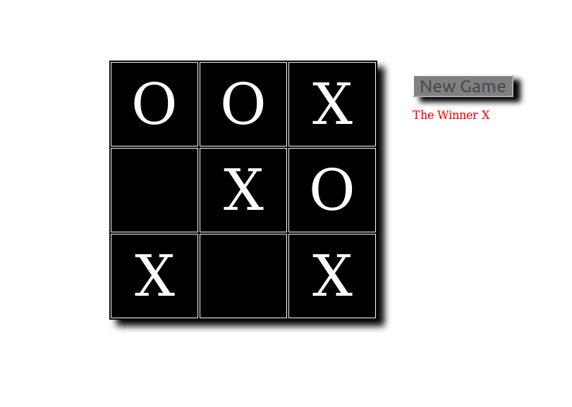

# Tic-Tac-Toe Game

* 2 player

* the game built using HTML/JavaScript/CSS . No dependencies.

# OverView
 
* Click on the black squares to move 

# Game Rules

 * The object of Tic Tac Toe is to get three in a row
 * The first player is known as X and the second is O
 * Players alternate placing Xs and Os on the game board until either oppent has three in a row or all nine squares are filled

